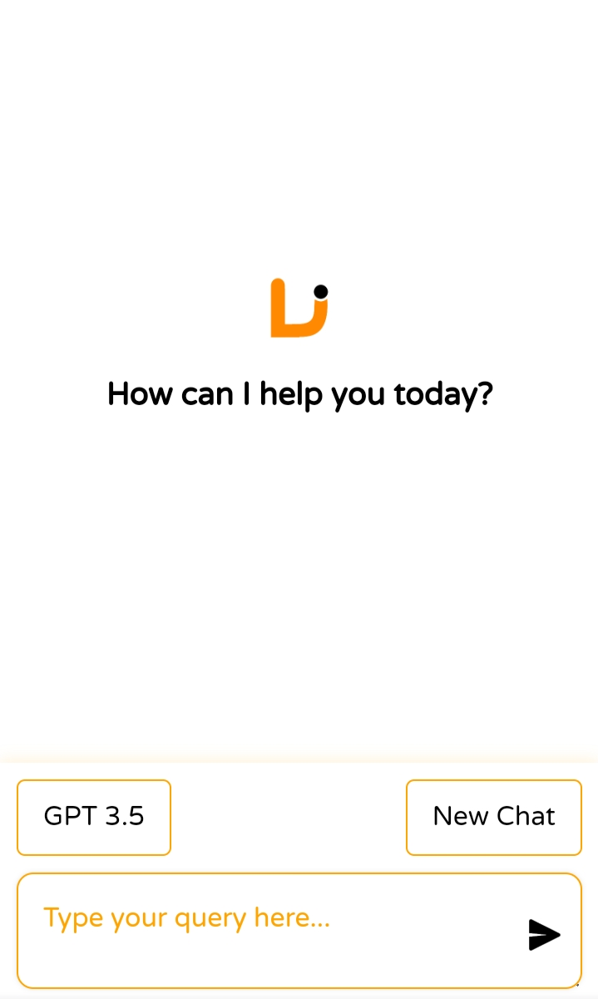
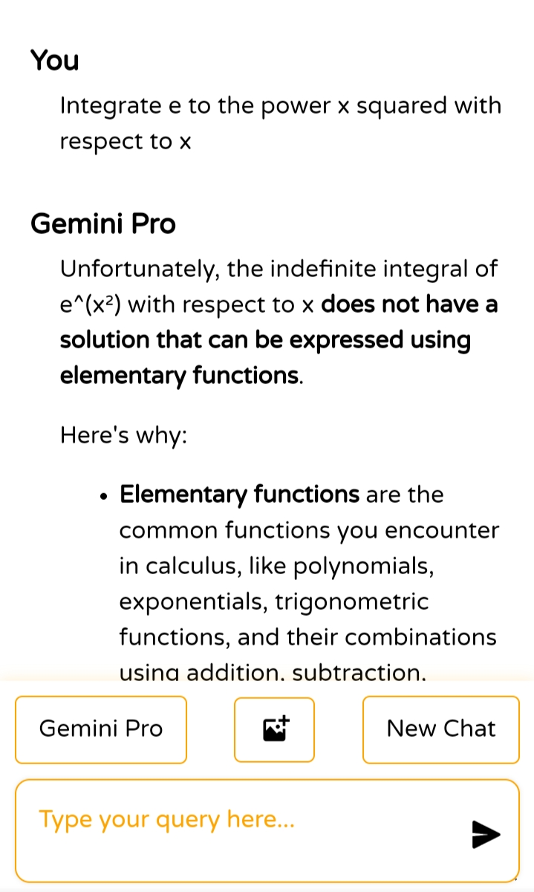
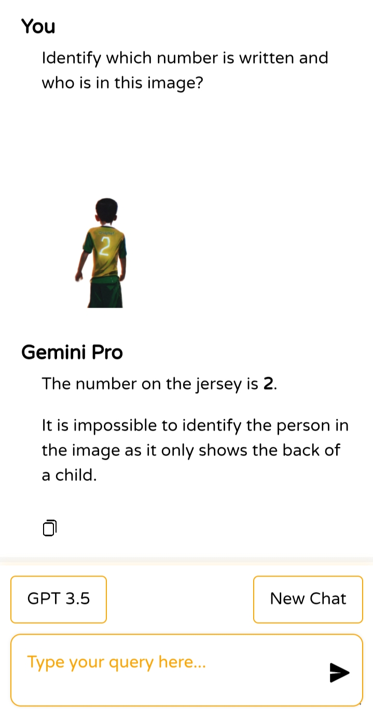

# AI Question Answering and Image Processing Website

This is an AI-powered web application that can answer questions, analyze images to describe their content, and generate beautiful images from text prompts. Built using Python and Flask, and hosted on Render, it leverages the Gemini API and GPT4Free Library to perform AI-driven tasks.

## Features

**Question Answering**: The AI can answer any question using natural language processing and web search capabilities.

**Image Analysis**: Upload an image, and the AI will describe what's in the image.

**Image Generation**: Create stunning images based on user-provided text prompts.

**User-Friendly Interface**: Simple and intuitive UI for easy interaction with the AI capabilities.


## Technologies Used

**Backend**: Python, Flask

**AI & Image Processing**: Gemini API and GPT4Free library

**Frontend**: HTML, CSS, JavaScript

**Hosting**: Render server


## How It Works

1. **Ask Questions**: Users can type questions, and the AI will use advanced natural language processing to provide accurate answers.


2. **Analyze Images**: Users can upload an image, and the AI will detect objects and provide descriptions of what's visible in the image.


3. **Generate Images**: Based on a user's text prompt, the AI will create visually stunning images.


## Installation

1. Clone the repository:

```bash
git clone https://github.com/TechnicalVishalJi/Python-Web-App.git
```


2. Navigate to the project directory:

```bash
cd ai-question-image-app
```


3. Install the required dependencies:

```bash
pip install -r requirements.txt
```

1. Set up your environment variables:

Add your Gemini API key in an .env file.
```bash
GEMINI_API_KEY=your_api_key_here
```


5. Run the Flask application:

```bash
flask run
```


6. Open the app in your browser at http://127.0.0.1:5000.


## How to Use

1. **Ask a Question**: Type a question in the provided input box, and the AI will return an answer.


2. **Upload an Image**: Use the image upload feature to submit a picture for the AI to analyze and describe.


3. __Generate an Image__: Enter a creative prompt, and the AI will generate an image based on your description.


## Example Prompts for Image Generation

- "Create a sunset over a mountain range with a vibrant color palette."

- "Design a futuristic cityscape with flying cars and neon lights."


## Screenshots





License

This project is licensed under the MIT License - see the LICENSE file for details.


---

Made with ❤️ by Vishal Singh
